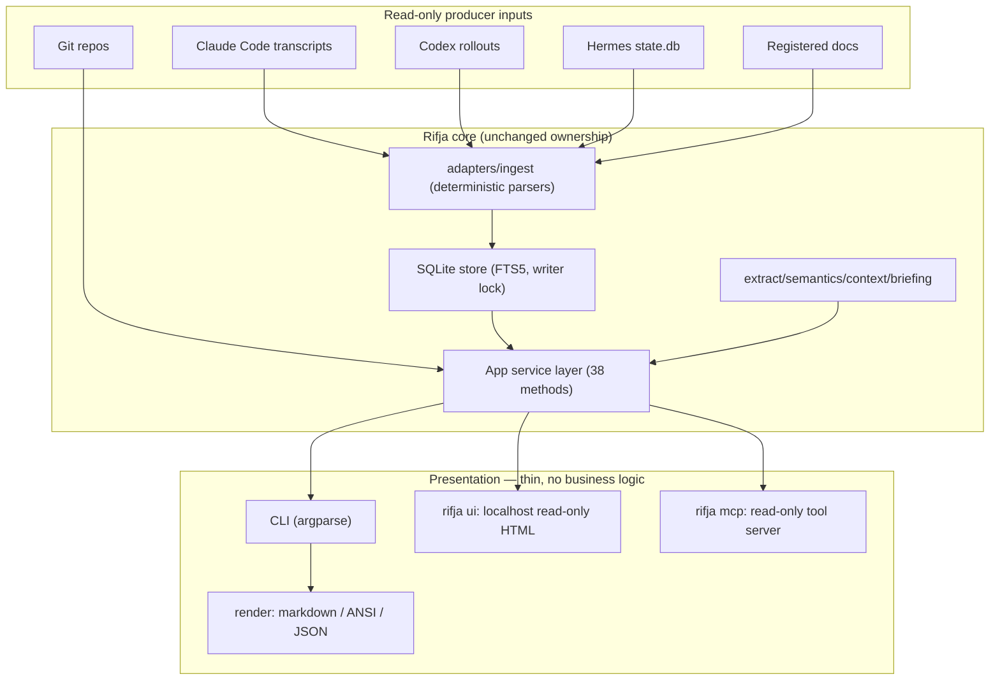

# Rifja Evolution Proposal — Product, UX, Architecture, Competitive Landscape

**Status:** Final draft for review · 2026-09-07 · research complete
**Scope:** Assessment/proposal only. No implementation.
**Evidence labels:** `[V]` verified against the repo or live CLI on this machine · `[R]` market research finding (source linked) · `[REC]` recommendation · `[SPEC]` speculation requiring validation.

---

## 1. Current Project Assessment

### 1.1 Architecture `[V]`

15 modules, ~7,460 lines, Python ≥3.14, **zero runtime dependencies** (`pyproject.toml:19`). Three-layer separation:

| Layer | Module(s) | Role |
|---|---|---|
| Presentation | `render.py` (632 lines) | `readable(kind, data)` dispatcher → per-kind markdown emitters; `safe_output()` sanitizer |
| Business logic | `app.py` (1,265 lines) | `App` class, 38 domain methods; `@snapshot` transactional reads |
| Data access | `store.py` | `Store`: transactions, writer lock, backup/restore, audit |

Ingestion (`ingest.py`, `adapters.py`, `compressed.py`) is deterministic and format-parsing only; extraction (`extract.py`, `semantics.py`) is rule-based. The threat model (`docs/rifja-threat-model.md:35`) Mermaid diagram matches the current code — it is current, not historical.

**Key architectural fact: the service layer already exists.** `App` methods are presentation-agnostic and return plain dicts; the CLI is a thin argparse dispatcher delegating to `App` and passing results to `render.readable()`. A second frontend (web UI, MCP server) can call the same methods with no business-logic duplication. The owner's "shared core" requirement is already 80% satisfied by the existing design.

### 1.2 Verified UX findings `[V]` (exercised live, fresh `--home` and owner state)

| # | Finding | Evidence |
|---|---|---|
| 1 | Human mode emits **raw JSON** for `setup`, `doctor`, `source list`, `search` — the human/JSON distinction barely exists | `rifja setup` → JSON block; `rifja doctor` → JSON checks array |
| 2 | `source list` embeds **double-encoded JSON inside JSON** (`"stats": "{\"sources\": 0, ...}"`) — internal state leaking into user output | `source list` live output |
| 3 | `refresh` on real data (813 sources, 375k records) ran **3m26s with zero output**; users see nothing, then a JSON dump; partial result exits 3 | Observed 2026-09-07 |
| 4 | Errors are bare contract labels with **no suggested next action**: `Error: project_not_found`, exit 2 | `rifja resume nope` |
| 5 | Bare `rifja` prints a raw argparse usage dump and exits 2 — no orientation, no next step | Live |
| 6 | Help is a single 22-command brace list — no grouping, no "start here" | `rifja --help` |
| 7 | `setup --timezone` is **hardcoded `default="UTC"`** (`cli.py:47`); system TZ (Europe/Istanbul) is never detected; daily bucketing silently off by hours | `cli.py:47`, live setup output |
| 8 | `source discover` finds provider paths but does not offer to register them — discovery dead-ends into manual commands | Obs 23190 `[V]` |
| 9 | First run has no guided path: no `rifja init`, no wizard; `setup` tells you two more commands to run | Live |
| 10 | One good message: `tasks` → "No unfinished work identified" — proof the team already knows how to write human output when it thinks about it | Live |

### 1.3 Strengths to preserve `[V]`

- Offline by construction; `network_required: false`; nothing phones home.
- Explicit collection scope — nothing is read that wasn't registered.
- Read-only producer inputs; no-follow, byte/depth limits, redaction before persistence and FTS.
- Stable IDs, memory/corrections, tombstones (`forget`, `retention`) — rare and valuable.
- Evidence provenance and authority separation (quotes fenced, superseded generations excluded from active instructions).
- Disciplined exit codes (0/2/3/4/130) and versioned `--json` envelope — already automation-friendly.
- A real threat model with assets/attacker/surfaces tables.

### 1.4 Honest weaknesses `[V]`

The engine is better than the storefront. Every gap in §1.2 is presentation or flow, not architecture — which is exactly why this can be fixed without a rewrite.

---

## 2. Market Landscape

*(Primary-source findings, collected and verified 2026-09-07:)*

### 2.1 Memory plugins for coding agents `[R]`

- **claude-mem** (thedotmack) — the closest well-known neighbor and the category's scale proof: **Apache-2.0, 93.4k stars, 334 open issues, pushed 2026-09-07** `[R]` (GitHub API). Plugin-marketplace distribution, SQLite (158MB observed locally) + Chroma vector store, LLM-compressed "observations," background worker with health supervision, multi-platform plugin dirs (`.claude-plugin`, `.codex-plugin`, `.cursor-plugin`, `.grok-plugin`), monetized via cmem.ai Pro. Its open issues document the LLM+vector architecture's failure modes: 74GB swap exhaustion from orphaned process pairs (#3905), a 395GB Chroma store filling a disk (#3879), observer recording untested hypotheses as confident findings and never amending them (#3897), 82% of condense calls discarded after timeout on oversized payloads (#3839), cross-session message dispatch (#3812). Sources: github.com/thedotmack/claude-mem (issues).
- **Lesson:** the LLM+vector approach buys compression but costs reliability, disk, money, and trust — and its failures are exactly the failure modes Rifja's determinism eliminates.

### 2.2 Session/continuity tool ecosystem `[R]` (verified via GitHub API, 2026-09-07)

| Tool | Status | Stars | Last push | Local? | License |
|---|---|---|---|---|---|
| ccusage | MAINTAINED | 18,407 | 2026-09-07 | Yes | MIT |
| Conductor (conductor.build) | MAINTAINED (closed) | n/a | active v0.84.2 | Hybrid | Proprietary |
| Crystal | **DEAD** | 3,115 | 2026-02-26 | Yes | MIT |
| vibe-kanban | **DEAD/SUNSET** | 28,032 | 2026-04-24 | Was hybrid | Apache-2.0 |
| Omnara | MAINTAINED (pivoted) | 2,822 | 2026-09-07 | No (cloud) | Apache-2.0 |
| Claude Squad | MAINTAINED (thin) | 8,443 | 2026-08-20 | Yes | AGPL-3.0 |
| ctx | **STALE** | 128 | 2026-04-21 | Yes | MIT |
| claude-supermemory | MAINTAINED | 2,745 | 2026-09-07 | **No (cloud)** | **NONE** |
| opencode-claude-memory | MAINTAINED | 57 | 2026-09-06 | Yes | MIT |

**Headline: 2 of 9 dead (including the largest, at 28k stars), 1 stale, 1 pivoted out of the category, 1 cloud-only and unlicensed.** Only three are both maintained *and* local-first — and those are the smallest. Sources: github.com/ccusage/ccusage · github.com/stravu/crystal (deprecated → nimbalyst.com; issue #235) · github.com/BloopAI/vibe-kanban (sunset post 2026-04-10: "couldn't find a business model"; upgrade wiped tasks #2687; sunset build made projects export-only #3396) · github.com/omnara-ai/omnara (pivoted to managed-agent runtime) · github.com/smtg-ai/claude-squad (maintainer bandwidth admission, #250) · github.com/dchu917/ctx (one zero-comment issue in its lifetime) · github.com/supermemoryai/claude-supermemory (no LICENSE file — all rights reserved; per-worktree memory silos #27; ignored `skipTools` capture #12).

Ecosystem lessons that shape the recommendations:

1. **ccusage** (18.4k★) proves demand: read-only analysis of local agent logs can reach mass adoption with zero vendor cooperation — and it nearly collapsed when the upstream `costUSD` field changed (issue #4). → *Freeze a durable own-format index; never derive on-demand from files another party can change or delete.* (Rifja already does this.)
2. **Crystal/vibe-kanban deaths** show UI-heavy continuity tools become abandonware when maintainer bandwidth runs out. → *A session-history tool must be boring and cheap to maintain.* (Argues for stdlib, no Electron, no SPA — §6, §8.)
3. **Vibe Kanban's shutdown** let the vendor remotely degrade the "local-first" OSS build. → *Core state must never require a vendor round-trip.* (Rifja: fully offline by construction.)
4. **Omnara's pivot** shows continuity tools drift into orchestration platforms to find a business model. → *Refuse to become a runtime.* (§13.)
5. **claude-supermemory's failure modes** (cloud-mandatory API key, unverifiable capture, worktree silos) are literally the local-first pitch. → *Opt-out must be verifiable; hooks must never stall the agent.* (Governs §9 hook design.)
6. **ctx** had the two right ideas (immutable transcript binding, branch-without-sharing-future-writes) and still didn't take off. → *Correct design doesn't create demand; the deletion problem does the marketing.* (§11.)

### 2.3 Demand-side pain signals `[R]` (ranked, with independent sources)

1. **Transcripts are silently deleted by default — the strongest signal, and the one entire products are being built in response to.** Official docs: Claude Code deletes `projects/<project>/<session>.jsonl` ("Full conversation transcript") after `cleanupPeriodDays`, **default 30 days** (code.claude.com/docs/en/claude-directory). Verified open issues: #41458 — "cleanupPeriodDays: 99999 has been set… 490 session JSONL files were silently deleted"; #62476 — "no first-run disclosure, no warning before deletion… I lost months of conversation history"; #90148 — a project-level setting controls the machine-wide sweep. HN: "Two of my projects lost their whole history that way" (news.ycombinator.com/item?id=48921255); ccusage-visible 30-day cliff (id=48571537); Claude-File-Recovery at 99 pts (id=47186890).
2. **Compaction destroys context** — the longest-recurring theme: 10+ `anthropics/claude-code` issues titled "X lost after context compaction" (Feb–Jul 2026, #29922…#80938); HN 1220-pt thread: "For Claude Code compaction feels disastrous" (id=47373475); #80938: "~10h lost senior time, and massive trust erosion." Anthropic's own docs concede the mechanism: hooks are "Summarized with the rest of the conversation," and post-compaction only ~5 recent files are re-read (code.claude.com/docs/en/context-window).
3. **Cross-tool/cross-agent portability** — accelerating: "The session you cannot take with you," 790-pt HN thread (id=49118781); ~8 independent Show-HN launches in 2026 (deja id=48923305, session-roam, engrim, …) all independently converging on "index the JSONL transcripts."
4. **Resume unreliable across days/weeks** — Anthropic staff concede it: "continue a stale session, it's often a full cache miss" (id=47740541); "Start fresh instead of resuming large sessions that have been idle ~1h" (id=47771648).
5. **Local-only preference** — recurring as *vendor marketing*, **not** as first-person grievance. Verdict: local-first is table stakes / a trust qualifier, not the headline. **Deletion is the demand generator; local-first is the qualifier.**

*(Methodology note: HN/GitHub quotes verified from raw objects; Reddit quotes lower-confidence; a reported Register article was 404 and is excluded.)*

### 2.4 LLM observability platforms `[R]`

- **Langfuse** — MIT core + `ee/` enterprise dirs, copyright ClickHouse Inc; self-host or cloud; instrumentation-first.
- **Arize Phoenix** — **Elastic License 2.0**, not Apache (corrected against LICENSE file); `phoenix serve` localhost UI; ELv2 prohibits offering it as a managed service.
- Category pattern: all ingest **live instrumented traces** via SDK/OTel; none import retrospective transcript files. They answer "what did this run do," not "where was I three weeks ago."

### 2.5 Platform built-ins `[R]` (official docs, Sept 2026)

- **Claude Code built-ins are substantial**: CLAUDE.md hierarchy (managed → user → project → local, `@path` imports 4-hop max, `.claude/rules/*.md`), auto-memory directory (`~/.claude/projects/<project>/memory/`, MEMORY.md first 200 lines/25KB injected per session, on by default — and memory files are **excluded** from the retention sweep), `--continue`/`--resume` (with cross-project ID lookup), `/branch`, `/rewind` (100 most recent checkpoints, which **do** die in the retention sweep), `/compact`. Transcripts: JSONL at `~/.claude/projects/<project>/<session-id>.jsonl`, `cleanupPeriodDays` default 30.
- **Claude Code's official position on third-party parsing is explicitly negative** (code.claude.com/docs/en/sessions): *"The entry format is internal to Claude Code and changes between versions, so scripts that parse these files directly can break on any release. To build on session data, use `/export` or the script interfaces instead."* Sanctioned interfaces: `/export`, `claude -p --resume <id> --output-format json`, hook/statusline `transcript_path` field, Agent SDK.
- **Codex CLI**: rollout JSONL under `$CODEX_HOME` (`sessions/`, `archived_sessions/` — both already parsed by Rifja's adapters), `history.jsonl`, `codex resume/fork/archive/delete`, `--ephemeral`. Schema documented only in the `codex-rs/rollout` Rust source — **undocumented, no stability statement, no official query API** (closest: `codex app-server` embedding protocol). Codex's built-in **memories** feature prunes by age too: `memories.max_rollout_age_days` **default 30** (cap 90). Docs base: `learn.chatgpt.com/docs/` (verified 308 from developers.openai.com; every page has a `.md` twin + `llms.txt`).
- **AGENTS.md**: 23 tools honor it, stewarded by the Agentic AI Foundation (Linux Foundation); **Claude Code does not read it natively** ("Claude Code reads CLAUDE.md, not AGENTS.md" — import/symlink workaround documented).
- Recurring CLAUDE.md bloat complaints (Reddit r/Anthropic, HN, practitioner blogs): files grow to 400–1500 lines, degrade instruction-following, inject stale directives.
- **Implication:** *both* major platforms prune on ~30-day horizons by default; neither offers long-halflife, cross-project, cross-agent continuity with provenance. The wedge in §5 is structural, not incidental.

### 2.6 Standards `[R]`

- **MCP** is the de-facto tool-surface protocol (spec 2026-07-28; sampling/logging deprecated). **Memory-server conventions do not exist** — the only convention is by example (`@modelcontextprotocol/server-memory` reference implementation, ad-hoc entities/relations graph). A Rifja read-only MCP tool surface would be convention-**setting**, not convention-following — low collision risk, some leadership opportunity.
- **AGENTS.md**: broad adoption (23 tools, 60k+ OSS projects), no required fields, nearest-file-wins.
- **A2A**: real and stable (v1.0, Linux Foundation, 8-company TSC) — but it is agent-to-agent *communication*, not a memory/session format. Irrelevant to Rifja's core.
- **OTel GenAI semantic conventions**: still `Status: Development` across the board (dedicated repo since 2026-05); agent spans (`create_agent`, `invoke_agent`, `execute_tool`…) and `gen_ai.conversation.id` are specified but unstable. OTel remains a **live-instrumentation** story — orthogonal to retrospective import.
- **A standard for retrospective import of pre-existing session transcripts: DOES NOT EXIST.** Closest approximations, none ratified: ATIF v1.8 (Harbor trajectory spec — eval-oriented RFC), Letta issue #3237 (open "Conversation Import API" request since 2026-03), mem0ai/openmemory (vendor CLI doing ad-hoc session conversion, beta), arXiv:2605.11032 "Portable Agent Memory" (single-author protocol, no adoption). **Rifja's deterministic import layer is therefore not fighting any incumbent standard — and its stable internal format is a candidate to eventually publish as one.**

---

## 3. Competitor / Comparable Tool Matrix

*(All rows verified 2026-09-07 via GitHub API and official docs.)*

| Tool | Category | CLI | Dashboard | Local-first | Agent integrations | Plugin model | Open source | Key strength | Key weakness | Relevant lesson |
|---|---|---|---|---|---|---|---|---|---|---|
| Mem0 | Memory platform | **No** (lib/server) | None OSS | Self-host (Qdrant embedded) | SDK/MCP | SDK | Yes (Apache-2.0, 64.9k★) | Lowest-friction install in category | **LLM API key required**; prod audit "97.8% junk" (#4573); silent batch loss (#5245); graph mem removed from OSS | LLM-extracted memory ≠ trustworthy memory |
| Letta (MemGPT) | Agent-state server | Yes (`letta` code CLI) | Desktop app | Local supported; Docker unsupported | SDK, Slack | SDK | Yes (Apache-2.0, 24.6k★) | Real CLI + memory blocks | Every turn needs an LLM; compaction wiped history (#3270) | `/doctor` in a memory CLI is good UX to copy |
| Graphiti/Zep | Temporal knowledge graph | No (lib + MCP server) | Zep cloud console | OSS local but heaviest (Neo4j/FalkorDB + LLM) | MCP server | SDK | Yes (Apache-2.0, 30.7k★) | Bi-temporal provenance model | LLM-bound ingest; fragile local setup (#868, #566) | Bi-temporality is the right idea, done with heavy machinery |
| claude-mem | Memory plugin | Limited | None (worker logs) | Partial (LLM API cloud) | CC, Codex, Cursor, Grok | CC plugin marketplace | Yes (Apache-2.0, 93.4k★) | Set-and-forget capture at scale | 334 open issues; stability/resource/trust failures are architectural | Distribution via marketplace works; reliability is the differentiator gap |
| ccusage | Usage analytics | Yes | No (statusline hook) | Yes | Reads 18 agent CLIs | Statusline hook | Yes (MIT, 18.4k★) | Zero-vendor-cooperation adoption | Value hostage to one upstream field (#4) | Freeze a durable own-format index |
| Conductor | Parallel agent workspaces | No (GUI only) | Native Mac app | Hybrid (cloud on Pro $50/mo) | CC, Codex, Cursor | Wraps CLIs | No | Polished GUI commercial winner | Closed; cloud monetization path | The GUI wedge is real — and monetized via cloud |
| Crystal | Session manager | No (Electron) | Native app | Yes | CC | None | Yes (MIT, 3.1k★) | Worktree parallelism | **Dead** (deprecated 2026-02 → Nimbalyst) | UI-heavy continuity = abandonware risk |
| vibe-kanban | Agent kanban | Server + web UI | Local web UI | Was hybrid | 10+ agents | None | Yes (Apache-2.0, 28k★) | Largest community in category | **Dead**; vendor degraded OSS build post-sunset (#3396) | Never let core state need a vendor round-trip |
| Omnara | Agent runtime (pivoted) | Yes (`npx`) | Hosted dashboard | No (cloud control plane) | Wraps CC et al. | Own API | Yes (Apache-2.0, 2.8k★) | Active, well-funded direction | Left the continuity category | Don't drift into being a runtime |
| Claude Squad | Multi-agent TUI | Yes (TUI) | No (tmux) | Yes | CC, Codex, OpenCode, Amp | None | Yes (AGPL-3.0, 8.4k★) | Terminal-native, simple | Thin maintenance, Windows broken (#275) | Determinism > features under bandwidth limits |
| ctx | Cross-agent resume | Yes | Optional local browser | Yes ("no API keys, plain SQLite") | CC + Codex | Skills dirs | Yes (MIT, 128★) | Right design (transcript binding, branching) | **Stale** — no demand materialized | Right design ≠ demand; deletion does the marketing |
| claude-supermemory | Cloud memory plugin | No (hooks) | supermemory.ai console | **No (mandatory cloud)** | CC, Codex, OpenCode | CC plugin (hooks) | **No license** (2.7k★) | Team memory, easy install | Unlicensed; unverifiable capture (#12); hook hangs (#25) | Cloud incumbent's failures = local-first pitch |
| opencode-claude-memory | Memory bridge | No (plugin) | No | Yes | CC + OpenCode | OpenCode plugin | Yes (MIT, 57★) | Shared Markdown memory | Entire bug list is foreign-format drift (#19,#24,#31) | Pin/validate foreign schemas, fail loudly |
| Langfuse | LLM observability | API-first | Web UI (self-host/cloud) | Self-host possible | SDK/OTel instrumentation | SDKs | MIT core + EE | Rich trace UI | Live instrumentation only; heavy stack | Localhost self-host UI pattern is proven |
| Phoenix | LLM observability | `phoenix serve` | Local web UI | Yes (local) | OTel/SDK | OTel ecosystem | Elastic v2 (source-available) | One-command local UI | ELv2 restrictions; instrumentation-first | `serve` → auto URL pattern to imitate |
| Claude Code built-ins | Platform | `/resume` `/compact` `/rewind` | None | Yes | Native | Hooks/plugins/MCP | Closed | Zero-setup continuity | 30-day transcript deletion default; compaction loss; single-platform | The gap: long-halflife, cross-project, cross-agent, provably kept |
| **Rifja (today)** | Continuity layer | 22 commands, JSON-default | None | **Yes, fully offline** | CC+Codex+Hermes via adapters | None yet | Yes (MIT) | Provenance, determinism, retention/forget | Presentation-layer UX debt | — |

---

## 4. Recurring Industry Patterns

- **CLI UX `[R]`:** clig.dev conventions — human-readable by default, `--json` for machines, grouped help, errors that state problem + next action, `NO_COLOR`/TTY detection. Modern tools (uv, gh, cargo) group commands by noun and mark a "start here" path.
- **Localhost dashboards `[R]`** (verified current defaults): the universal pattern is *one subcommand → loopback bind → print URL*. **Auth is the differentiator:** Jupyter alone ships token auth on by default (`127.0.0.1:8888`, auto-generated token, `--no-browser`); MLflow (5000), TensorBoard (6006), Streamlit (8501), Aim (43800) all default to **no auth** — acceptable for experiment data, not for private transcripts. **Auto-open is *not* the norm:** only Streamlit opens a browser by default (and auto-disables when `DISPLAY` is unset over SSH); TensorBoard/MLflow/Aim/Jupyter print the URL and stay quiet. Aim also has `--read-only` and `--uds` flags — a Unix-socket serve mode is a strong option for a zero-network-posture tool.
- **Plugin architecture `[R]`:** MCP as the universal tool surface (memory conventions absent — §2.6); Claude Code hooks (SessionStart etc., official `transcript_path` handoff) as the injection/capture surface; plugin marketplace as the distribution surface — all three proven by claude-mem's reach.
- **Onboarding `[R]`:** brew install → first command works → `doctor`-style health check → guided first source/project registration (gh auth login pattern). Letta's CLI ships `/doctor` and `/search` as first-class commands — validation-as-command is now table stakes.

---

## 5. Current Project vs Market Gap Analysis

The demand research reorders this table: **the wedge is §2.3 pain #1 — producers silently delete the history.** Rifja is structurally an *archive-against-deletion* with an index, and nobody in the verified landscape combines (a) durable own-format retention, (b) cross-agent scope, (c) provenance. That combination is the white space.

| Dimension | Table stakes (we lack) | High-value (we lack) | Differentiator (we **have**, market mostly lacks) |
|---|---|---|---|
| Output | Human output in human mode; progress; grouped help; error next-steps | `rifja init` guided flow | — |
| Continuity | — | — | Cross-agent (CC+Codex+Hermes) evidence with provenance and stable IDs |
| **Data survival** | — | A first-run message that says what deletion risk Rifja removes | **Durable own-format index that survives producer deletion** (30-day defaults `[R]`, ignored-setting bugs `[R]`); `retention`/`forget` give the operator equivalent control |
| Memory | — | TZ detection; better default memory ergonomics | Deterministic, no-LLM, no-API-key memory; corrections authoritative over agent claims |
| Data care | — | — | Explicit scope, backup/restore, threat model |
| UI | — | Read-only localhost dashboard | — |
| Trust | — | Verifiable opt-out (supermemory failed this `[R]`) | Superpowers claude-mem cannot copy without abandoning its architecture |

Unnecessary complexity to *avoid* (verified failure modes elsewhere): vector stores, background daemons, vendor control planes, LLM observers — every one maps to a documented competitor failure in §2.2/§3.

---

## 6. CLI UX Proposal `[REC]`

**Decision: a pure-stdlib ANSI presentation layer inside `render.py`'s replacement/evolution — no Rich dependency.**

Why this and not alternatives:

- *Why evolve `render.py`:* it is already the single output choke point; `App` returns dicts; nothing upstream changes. Presentation debt is contained in one module by the project's own design.
- *Why no Rich:* `dependencies = []` is a stated property (stdlib runtime under Homebrew). A soft-dependency creates two rendering paths to test forever, and Rifja's needs (headings, status glyphs, tables, progress lines, 256-color accents) are fully covered by ~300 lines of ANSI with `NO_COLOR`/`--no-color`/non-TTY fallback to today's plain output. Rich's widgets (live dashboards, markdown rendering in-terminal) are not needed.
- *Why keep argparse:* rewriting the parser (click/typer) is churn with no user-visible payoff; grouping and help formatting are achievable in argparse.

Concrete shape:

1. **Command groups in help:** Setup (`setup init doctor config`), Data (`source document project refresh retention forget`), Inspect (`daily resume session tasks decisions items search explain`), Deliver (`export memory constitution backup restore`). Overview screen when bare `rifja` is run: one-line what-it-is + "start here" (exit 2 preserved, text humanized).
2. **Status vocabulary:** one glyph/word system — `✓ passed`, `⚠ partial`, `✗ failed`, `• info` — with plain-text fallback (`passed/partial/failed`) when not a TTY; identical vocabulary in CLI, doctor, dashboard.
3. **Progress for long operations:** `refresh` emits a stderr progress line (source n/m, records parsed/inserted, current file) on a bounded cadence (e.g. every 250ms, updated in place on TTY, plain new lines otherwise). `--quiet` suppresses. JSON mode: progress on stderr, final envelope on stdout — so existing automation is untouched. Exit 3 partial already correct; add a human summary of *which* sources were partial.
4. **Error hint map:** every contract label gets a next-action line, e.g. `project_not_found` → "Registered projects: `rifja project list`. Register one: `rifja project add PATH`." Hints live in one dict keyed by the contract label. JSON contract addition: today the error path writes plain text to stderr and never emits an envelope (`cli.py` catches `ValueError`/`BusyError` → exit 2/4 `[V]`); this proposal defines a **versioned JSON error envelope** for `--json` mode — `{schema_version, error: {code, message?, hints: []}}` on stdout with exit codes 2/3/4 unchanged — so automation gets machine-readable hints too. Success payloads gain no new fields.
5. **Human renderers for every command that currently dumps JSON** (`setup`, `doctor`, `source list`, `search`, `config get`): short tables/lines; JSON still available via `--json`. Fix the double-encoded `stats` string at the same time (parse before render).
6. **Verbosity:** `-q`/`--verbose` global pair; default is concise; verbose adds per-source diagnostics that today only appear in JSON.

Non-goals: no interactive TUI framework, no mouse, no live-refreshing screens (k9s-style) — that is dashboard territory.

---

## 7. Setup & Onboarding Proposal `[REC]`

**Decision: add `rifja init` as the guided first-run path; keep `setup` as the non-interactive primitive.** Scripts and power users keep `setup`; humans get one command that does the obvious sequence and **asks before every state-changing step** (explicit scope is a security boundary — preserve it; the wizard proposes, the operator confirms).

Flow (all stdlib, no prompts library):

1. Detect existing state → offer resume-vs-fresh.
2. **Timezone:** detect from `TZ` env → `/etc/localtime` symlink (stdlib `os.readlink`; this machine resolves `Europe/Istanbul`) → verify the extracted key with `ZoneInfo()` (IANA validation only — a missing symlink or a non-IANA regular file ends the chain). If every detection step fails, the wizard **asks** with UTC pre-filled as an explicit question; UTC is never applied silently (`cli.py:47` today). An explicit `--timezone` flag overrides the whole chain.
3. **Discovery:** run `source discover`, present found provider paths as a numbered menu ("register codex sessions at ~/.codex/sessions? [Y/n]"), each registration echoing the read-only promise. Where the producer has a deletion policy (e.g. Claude Code's 30-day transcript sweep `[R]`), say so in one line: registration is what makes this history survive.
4. **Projects:** offer `project discover`-style suggestions (explicit paths only — never implicit disk scanning), or skip.
5. **First refresh as an explicit consent step:** the wizard states that refreshing writes indexed records, refresh state, and coverage data into the private state directory, and runs only on confirmation (registration consent does not implicitly authorize it). Runs with the §6 progress line, then prints a human summary: N sources, M records, K projects, plus `rifja resume PROJECT` as the "start here."
6. End with `doctor` (human mode) as the health gate.
7. Any command run with empty state and no setup → one-line hint: "No state yet — run `rifja init`." (Today: silent JSON.)

Preserved boundaries: nothing registered without explicit confirmation; no network; no auto-import of unregistered paths; all wizard proposals re-checkable afterwards via `doctor`/`config`.

---

## 8. Local Dashboard Proposal `[REC]`

**Decision: build it — read-only first — as `rifja ui`, served by stdlib `http.server`, rendering server-side HTML from the same `App` layer.**

Why it fits the architecture: `App` is already the service layer; a UI is a third renderer next to markdown and JSON. No daemon, no database duplication, no Node toolchain, no new persistence — it cannot drift from the CLI because it executes the same methods through the same writer lock.

Trust model (must stay inside the threat model's claim "no unauthenticated network endpoint"):

- Bind `127.0.0.1` only, explicit `--port` with a default in a Rifja-owned range, refuse to start if the port is taken (never fall back silently).
- **One-time bootstrap token, not a reusable URL credential:** launch prints `http://127.0.0.1:PORT/?t=<one-time>`; the first authenticated request exchanges it for a scoped, expiring `HttpOnly`+`SameSite=strict` session cookie, the bootstrap token is invalidated immediately, and all routes (including `/state`) require the session. Response headers `Cache-Control: no-store`, `Referrer-Policy: no-referrer`. This is deliberately *above* category norm (MLflow/TensorBoard/Streamlit/Aim default to no auth `[R]`; a bare query-param token would persist in browser history, copies, and logs) because session transcripts are more sensitive than experiment metrics. `--uds` Unix-socket mode (Aim has one `[R]`) remains the optional zero-TCP posture.
- **Output encoding is a renderer invariant, not an afterthought:** transcript-derived content is adversarial by the threat model's own definition, and loopback binding plus tokens do not neutralize it. The HTML renderer defines context-specific escaping (HTML body, attribute, URL) as separate functions, prohibits inline script interpolation entirely, ships a restrictive CSP (`default-src 'none'` + minimal style/img policy), and is tested against adversarial transcript fixtures (escaped markdown, `javascript:` URLs, attribute-breaking content) — the HTML counterpart of `render.safe_output()`. URL escaping is not URL safety: every URL sink enforces a scheme policy that allows only approved relative URLs and explicitly allowlisted schemes, rejecting `javascript:`, `vbscript:`, and unsafe `data:`/`blob:` values *before* escaping, with rejection itself fixture-tested.
- Browser behavior per verified convention: print the URL and stay quiet (Jupyter/TensorBoard/MLflow norm); open the browser only with an explicit `--open` flag (or interactive TTY confirmation). Auto-open without asking is the exception in the ecosystem, not the rule.
- Read-only in v1: GET-only handlers; no mutation endpoints at all — this is the strongest possible answer to "what is safe to expose."
- v2 (optional, explicit): a small allowlist of safe operations already CLI-exposed (`refresh`, `doctor`) behind POST + session + a **session-bound CSRF token** with `Origin`/`Sec-Fetch-Site` validation on every state-changing request — `SameSite=strict` does not cover same-site, cross-origin requests between different loopback ports, so the visible confirm is a UX control, not the CSRF boundary. Still no delete/export-to-disk from the browser.

Pages (each maps to an existing `App` method): Overview (doctor checks + coverage + last refresh), Timeline (daily), Sessions, Search (FTS5 `search`), Evidence/explain, Memory/constitution, Sources & scope. Every figure carries the same provenance labels as the CLI — the dashboard's differentiator is *evidence inspection*, not charts.

Presentation: server-rendered HTML + one static CSS file, no build step, no SPA framework, no websocket livestream in v1 (manual refresh; a `/state` JSON endpoint exists anyway because it's the same `--json` envelope).

What would break the decision: needing live push, multi-user auth, or rich client interactivity — none is evidenced; if livestream is ever wanted, add SSE to the same server rather than adopting a frontend stack.

---

## 9. Claude Code / Codex / Hermes Integration Analysis

The integration layer is three thin surfaces per platform. One honesty item first, because it shapes the whole layer:

**Producer-format reality `[R]`.** Claude Code's docs explicitly say third parties should not parse transcript JSONL (format internal, changes between releases; sanctioned: `/export`, `claude -p --resume --output-format json`, hook `transcript_path`, Agent SDK). Codex rollout files are undocumented with no stability statement (schema lives only in `codex-rs/rollout`). In practice, essentially every third-party tool in this market (claude-mem, ccusage, mem0's openmemory) parses these files read-only anyway — but Rifja should treat format breakage as a *scheduled* event, not a surprise: the existing partial-coverage/diagnostics machinery is the right answer, plus pinned test corpora per format version, plus an explicit adapter-version registry surfaced in `doctor`.

| Surface | Claude Code | Codex | Hermes |
|---|---|---|---|
| **In** (their data → Rifja): transcript adapters | JSONL parser exists `[V]` (unofficial format — see above) | Rollout parser exists `[V]` (`sessions/` + `archived_sessions/`) | `state.db` adapter exists `[V]` |
| **Out** (Rifja → their context): injection | SessionStart hook echoing `rifja resume`/bounded export; `CLAUDE.md` pointer (**CC does not read AGENTS.md** `[R]`) | `AGENTS.md` pointer (first-class in Codex, 32KiB budget) + `rifja export` | Hermes native briefing |
| **Query** (their agent → Rifja): MCP server | stdlib MCP server exposing `search`/`resume`/`explain`/`memory` as tools | `mcp_servers` in `config.toml` `[R]` | MCP-capable |

**Decision: build the MCP server as the single query surface for all three platforms** rather than per-platform plugins. One stdlib JSON-RPC implementation over `App` methods serves every current and future MCP-capable agent; marketplace/plugin packaging (claude-mem-proven distribution) becomes a thin manifest on top, not a code fork. The hook/prompt snippets per platform stay 10–30 lines each.

**MCP transport and authorization boundary (v1): stdio-only.** The server is spawned by the agent host (`mcp_servers` entry in Codex `config.toml` `[R]`, CC plugin/MCP config) and speaks JSON-RPC on stdin/stdout — no TCP listener, no daemon, no port. This preserves the threat model's "no unauthenticated network endpoint" property by construction: whoever can spawn the process already holds the operator's local authority. A socket- or network-capable transport is out of scope until it ships with explicit authentication, because tool results return transcript data.

Contention contract over MCP: `Store.BusyError` maps to a **per-request application-level error** — a successful JSON-RPC result with `isError: true`, a stable error code (reusing the CLI's contract labels), and retry guidance — never a server crash or a CLI exit code. The long-lived server stays available for subsequent requests.

Three design rules borrowed from verified competitor failures:

1. **Hooks must never stall the agent.** claude-supermemory's Windows hooks hang Claude Code for the full 30-second timeout `[R]`; Rifja's hook snippets must be `timeout`-bounded, output-bounded, and fail open (no output on error) — the SessionStart injection is best-effort decoration, never load-bearing.
2. **Injection stays in a data-only channel.** Transcript-derived text is untrusted model input: escaping and section labels do not stop a target agent from *following* instructions hidden inside it. Hook output and MCP tool results present content as quoted historical evidence through the authority-separating render path (`briefing.py`/`render.py`) — never inside instruction-priority files (`CLAUDE.md`, `AGENTS.md`), and memory fields carry only operator-accepted entries, never raw transcript text. Adversarial SessionStart fixtures (transcript text containing instructions) are part of the acceptance tests. Memory bloat (§2.5) is the failure mode to design against: bounded export sizes (already enforced, 24k chars `[V]`) are a feature to advertise, not a limit to lift.
3. **Injection must respect the authority model.** What a hook injects is *agent-visible historical evidence*, not instructions — preserving quote fencing and superseded-generation exclusion is what keeps imported authority conditional, exactly as the CLI contract already guarantees.

Preserved boundary: adapters remain format-parsers in `adapters.py`; they never gain network or execution behavior; the MCP server is read-only over the same store.

---

## 10. Recommended Shared-Core Architecture

Rules that keep the core "core":

1. `App` methods are the only way any surface touches state; every surface consumes the same dict shapes that already feed `render.readable()`.
2. Surfaces may not add persistence, network egress, or policy. Policy (redaction, scope, authority) lives in `privacy`/`context`, where it is today.
3. New platform support = a parser in `adapters.py` + a snippet in docs. Nothing else.
4. `--json` envelope remains the machine contract; ANSI/HTML are additive renderings of the same dicts.

---

## 11. Differentiation & Positioning

**Decision: position as the trustworthy, local-first continuity and evidence layer for coding agents — not as observability, not as a memory plugin. Lead the message with deletion survival, not local-first.**

The demand evidence is specific about messaging: local-first is what *every* competitor now claims (and one "local-first" vendor degraded its own OSS build from a control plane `[R]`), so it qualifies but doesn't sell. Silent transcript deletion is what creates urgency — it is the pain with irreversibility, official-doc confirmation, open bugs where the opt-out is ignored, and whole products built purely in response `[R]` (§2.3).

- **vs observability** (Langfuse/Phoenix/LangSmith): they instrument **live runs**; Rifja recovers **history across agents and time** with provenance. Different job, different user moment ("where was I" vs "what did this trace do").
- **vs memory platforms & plugins** (Mem0/Letta/Graphiti, claude-mem, claude-supermemory): they buy compression/abstraction with an LLM and pay in reliability — Mem0's own production audit found "97.8% were junk" across 10k entries (#4573) plus silent batch-embedding loss (#5245); claude-mem carries 334 open issues with 395GB stores and unamended false findings; claude-supermemory is cloud-mandatory and unlicensed `[R]`. No memory platform in the verified set offers a deterministic no-LLM ingest; Mem0's only non-LLM path (`infer=False`) still requires an embedder and vector search `[R]`. Rifja's differentiator is the *absence* of those failure modes: deterministic, bounded, offline, auditable, capture scope explicit and checkable (`doctor`, coverage).
- **vs platform built-ins**: single-platform, short-horizon, and they *delete the transcripts by default* `[R]`. Rifja is the long-halflife, cross-project, cross-agent layer the platforms structurally don't provide — and it preserves data they delete.
- **vs the graveyard** (§2.2): the category's dead pivot to GUI/runtime/cloud. Rifja's stdlib determinism is what makes it survivable at hobby bandwidth.

One-line positioning: **"Your coding agents delete their own history. Rifja keeps it — offline, with receipts."** (Secondary line for the README, not the pitch: deterministic cross-agent continuity with provenance.)

**Market density verdict (Q18):** the *adjacent* categories are crowded and violent — memory plugins/platforms are numerous and well-funded, observability is a mature market, and the session-tool graveyard shows heavy churn (§2.2). But the specific cell Rifja would occupy — *retrospective, cross-agent, deterministic, provenance-carrying continuity with durable retention against producer deletion* — is underserved: it has no incumbent (claude-mem is LLM-dependent and reliability-challenged, ctx had the right design and no distribution, platforms structurally won't do cross-vendor), low standardization pressure (no retrospective-import standard exists, §2.6), and demonstrated demand concentrated exactly on the deletion problem. Verdict: **fragmented neighborhood, underserved cell** — enter through the deletion wedge, not by competing inside the crowded categories.

The genuinely defensible moat is the evidence discipline (authority separation, provenance, corrections-over-claims, retention, threat model). It is slow to copy and unattractive to copy for LLM-centric competitors.

---

## 12. Risks and Tradeoffs

| Risk | Severity | Mitigation |
|---|---|---|
| Producer format churn — **explicitly anticipated by Claude Code's docs** ("scripts that parse these files directly can break on any release" `[R]`); Codex rollouts undocumented/unstable | High | Treat breakage as scheduled: adapter-version registry surfaced in `doctor`; tolerate/flag unknown shapes (partial coverage + diagnostics already built `[V]`); pinned test corpora per format version; fail as *partial coverage*, never silent corruption |
| Dashboard weakens the "no network endpoint" threat-model claim | High if careless | Loopback-only + per-launch token + read-only GET v1; update threat model doc with the UI as an explicit entry point |
| MCP/server code adds a second concurrency surface against the writer lock | Medium | Reuse `Store` locking unchanged; MCP handlers are just `App` calls; per-request `isError: true` contract with stable codes and retry guidance — server never exits on contention (§9) |
| Maintenance breadth: 3 platforms × formats × versions | Medium | Thin adapters only; no per-platform business logic; drop-platform is cheap by design |
| Scope creep into orchestrator/executor | Medium | §13 non-goals are binding; every PR names its layer |
| Presentation layer rework regresses automation (`--json` consumers) | Low | JSON envelope frozen; ANSI only on TTY; snapshot tests for JSON outputs |
| Competitor/platform adds built-in cross-agent memory | Low–Med | Built-ins are single-vendor by incentive; interoperability is structurally not their product |

---

## 13. What We Should Not Build

1. No LLM, embeddings, or vector store anywhere in the core — determinism is the product.
2. No cloud sync, telemetry, accounts, or phoning home.
3. No orchestrator/executor/agent runtime — Rifja reads; it doesn't run agents.
4. No write-back to producer stores (never mutate Claude/Codex/Hermes data).
5. No third-party plugin runtime — extensions are code-reviewed adapters, not a plugin API.
6. No Electron/Tauri app or SPA framework — server-rendered localhost pages only.
7. No implicit disk scanning / auto-registration of found sources — explicit scope stays.
8. No TUI dashboard in the terminal (k9s-style live screens) — that duplicates the web UI badly.
9. No feature-parity chase with observability platforms (trace ingestion, spans, dashboards-for-ML).

---

## 14. Prioritized Roadmap

| Phase | Scope | Exit evidence |
|---|---|---|
| **0 — Storefront** (first) | §6 CLI presentation layer; TZ detection fix; error hint map + versioned JSON error envelope; human renderers for all JSON-dumping commands; refresh progress; bare-`rifja` overview | Every command has a human mode indistinguishable in quality from `tasks`; refresh shows progress; existing success-payload JSON snapshots unchanged; the new error envelope ships as its own versioned contract with snapshot tests |
| **1 — Onboarding** | `rifja init` wizard (§7); discovery-to-registration menu; empty-state hints; doctor as first-run gate | Fresh machine → useful state in <5 min, all steps confirmed, zero network |
| **2 — Ecosystem in** | MCP server (search/resume/explain/memory, read-only); CC SessionStart hook + skill (timeout-bounded, fail-open); Codex `config.toml` + AGENTS.md docs; CC `CLAUDE.md` pointer (not AGENTS.md `[R]`); Hermes briefing snippet | Agent in each platform answers a "where was I" question via Rifja with provenance intact; hooks provably cannot stall a session (bounded-fail-open tests) |
| **3 — Dashboard** | `rifja ui` read-only (§8): overview/timeline/sessions/search/evidence/memory | Loopback+token; GET-only; every figure traceable to an App method; threat model updated |
| **4 — Distribution** | Plugin/marketplace manifests, Homebrew polish, docs site section | Install → init → resume flow documented with screenshots |

Phases 0–1 before any ecosystem work: the storefront problem is the adoption blocker; ecosystem reach multiplies a UX debt if done first.

---

## 15. Final Recommendation

Proceed with **shared core → CLI + optional local dashboard + thin MCP-based ecosystem adapters**, in that order. The architecture audit found the expensive part already done: `App` is a genuine service layer, so every proposed surface is thin — surfaces may orchestrate `App` calls (including state-changing ones like `rifja init`'s setup/registration/first refresh), while persistence, policy, and redaction stay owned by the core (`App`/`Store`/`privacy`), never reimplemented in a surface. The competitive audit found the opposite of a crowded gap in our specific cell: memory plugins are LLM-dependent and visibly unreliable; observability tools don't do retrospective transcript history; platforms prune short-horizon and stay single-vendor. Rifja's restraint (no LLM, no cloud, explicit scope, provenance) is not a limitation to hide — it is the differentiator, and phases 0–1 (storefront + onboarding) are the prerequisite to any of it being discoverable.

---

*All `[V]` claims were exercised against this checkout on 2026-09-07; `[R]` claims carry primary-source links (GitHub API pulls, official docs, HN items) from the same date. Reddit-sourced quotes are lower-confidence than HN/GitHub and are used only as corroborating signals; a reported Register article was excluded (404).*
