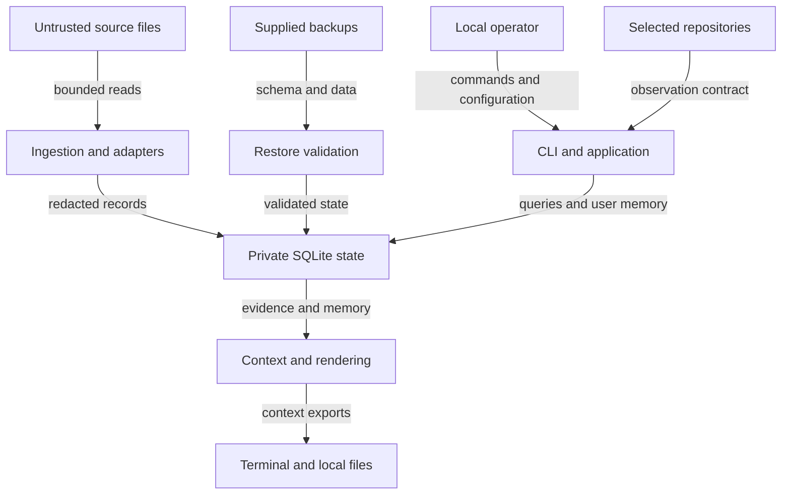

## Executive summary

The important boundaries are selected source files entering a private index, historical evidence becoming actionable context, and backup files becoming writable application state. The independent review found eleven concrete defects spanning schema imports, source paths, availability, freshness and rendering. All fourteen regression cases now pass in the corrected source; the older wheel identified in the review record failed four independently reproduced readiness cases. Final immutable-artifact outcomes are recorded separately in the external local `RELEASE-EVIDENCE` report. Source and artifact fingerprints, commands and historical failures are preserved in [review findings](review-findings.md). This is a bounded local review, not release approval.

## Scope and assumptions

The operator supplied this context: one local user; offline CLI/library; no server, multi-tenancy, credential service, model call or upload; private sessions/credentials are sensitive; selected repositories, transcripts and backup files may be hostile. Internal implementation decisions are delegated. These supplied facts supersede routine skill context questions. No unanswered service-context question changes the present risk ranking.

In scope: `app.py`, `store.py`, `ingest.py`, `privacy.py`, `adapters.py`, `context.py`, `render.py`, `cli.py`, and their data contracts. Tests use temporary synthetic files/databases. This reviewer authored `git.py` and `compressed.py`, so their internals are explicitly excluded from this independent certification; another reviewer owns those checks. The earlier authored resilience tests are supporting evidence, not a second independent review.

Out of scope: actual private transcripts, other `.local` data, remote accounts, OS compromise, malicious Python installation and Windows support claims. Only the expressly authorized synthetic `.local/install-candidate-1/report.json` was read. No code/data was uploaded. CodeRabbit was unavailable, so local manual and executable review was used. A server, shared state directory, unattended publication or custom SQLite extensions would require a new review.

## System model

### Primary components

- `cli.main` parses explicit commands and state paths, invokes `App`/`Ingestor`, renders versioned JSON or readable text and maps errors to exit codes. No network service appears in these entrypoints. [CLI](../src/rifja/cli.py)
- `Ingestor.refresh` enumerates configured roots, reads JSONL, Codex Zstandard JSONL or Hermes SQLite, normalizes/redacts records and commits source generations/checkpoints. `adapters` performs shape/role/schema handling; imported commands remain text. [Ingestion](../src/rifja/ingest.py), [adapters](../src/rifja/adapters.py)
- `Store` owns private SQLite state, FTS, schema migrations, snapshot transactions, refresh locking, backup and restore. User memory, corrections and forget tombstones are distinct from source-derived records. [Storage](../src/rifja/store.py)
- `App` and `context.details` compose current observations, source generations, historical evidence, user authority and uncertainty. Renderers escape dynamic Markdown and bound exports with omission notices. [Application](../src/rifja/app.py), [context](../src/rifja/context.py), [rendering](../src/rifja/render.py)
- Hatchling builds a Python >=3.14 package with a console script and no third-party runtime requirements. Development/build tools are a separate trust boundary. The inspected wheel contains 15 Python modules and metadata; it has no private data or checkout runtime path dependency. This applies to the reviewed hash, not a future rebuild. [Manifest](../pyproject.toml), [artifact evidence](review-findings.md)

### Data flows and trust boundaries

- Operator arguments/environment → CLI/application: paths, configuration, memory and references through local invocation. OS identity provides authority; reference syntax, options and lengths are validated. State permissions limit local access; there is no application authentication or encryption. (`cli.parser`, `App.memory_add`, `Store.__init__`)
- Configured filesystem → ingestion/adapters: paths, JSON bytes, compressed bytes and SQLite rows through local reads. Ancestor/final no-follow checks, regular-file validation, explicit exclusions and record byte/depth limits constrain ingestion. Hermes reads a consistent read-only transaction; ordinary table definitions are required and cooperative query budgets apply. Redaction precedes persistence and FTS. (`privacy.open_regular`, `Ingestor.record`, `adapters._open_db/_columns`)
- Imported records → derived context: redacted text, native IDs, role labels, timestamps and provenance through SQLite. Imported authority remains conditional: quote/fence boundaries apply, superseded generations do not supply active instructions/objectives, source uncertainties remain visible, and user corrections are separately authoritative. A changed configured source scope requires refresh and disappeared roots mark coverage partial. (`App.items`, `context.details`)
- Git observation contract → application state/display: status entries, revisions, paths and observation times. App persistence preserves the collector-bounded lists and fresh observations remain separate from old tool results. Collector execution controls are independently owned. (`App._save_snapshot`, `App.resume`)
- Backup file → restore → writable state: schema, rows and configuration through a read-only SQLite source and temporary staging directory. Supported version, full canonical schema definitions, quick check and foreign keys are validated before replacement of an empty destination. This rejects executable extensions but cannot prove supplied facts truthful. (`store.restore`, `validate_schema`)
- State/context → terminal or explicit export: excerpts, accepted memory, references and uncertainty through stdout or exclusive-created private files. Terminal controls are cleaned and dynamic Markdown/HTML escaped. Export consumers are outside this program's authority boundary. (`render._inline`, `bounded_export`, `cli.execute`)
- Concurrent application processes → state: reader snapshots, nested savepoints and bounded refresh ownership through SQLite and filesystem locking. Conflicting snapshot-to-write upgrades roll back and yield a controlled busy/retry result. (`App.snapshot`, `Store.transaction`, `writer_lock`)

#### Diagram

## Assets and security objectives

| Asset | Why it matters | Security objective (C/I/A) |
|---|---|---|
| Private session excerpts and credentials | Unintended ingestion or retained secrets expand exposure through search/backups/exports | C |
| Accepted memory, corrections and tombstones | Durable user decisions must survive rebuild and ordinary operations | I/A |
| Project/worktree identity and evidence applicability | Wrong location or obsolete intent can direct unsafe follow-up work | I |
| Repository and producer state | Read-only observation must not mutate inputs | I/A |
| Index, checkpoints and writer availability | Blocking or interrupted work must not destroy committed progress | I/A |
| Handoff text and provenance | Readers need source authority, uncertainty and disclosed omissions | I/C |
| Distribution artifact | A verified checkout does not establish what an installed user runs | I |

## Attacker model

### Capabilities

An attacker may supply text that later appears in configured transcripts or repository metadata, or a tampered backup the operator chooses to restore. A stronger local source writer can replace entries or ancestors and create special files where permissions allow. A hostile selected producer database may contain SQL views. Operator automation can accidentally pass sensitive auxiliary values. Ordinary concurrent writers, large histories and edited files create reliability failures without an attacker.

### Non-capabilities

There is no unauthenticated network endpoint. Text alone does not create files, grant permissions, execute commands or deliver exports to an attacker. The attacker is not assumed to replace the installed program, read the private state directory, install SQLite extensions or compromise the OS. Demonstrated SQLite trigger abuse affected application state, not OS execution. Export-driven influence still requires a recipient to interpret or act on the text.

## Entry points and attack surfaces

| Surface | How reached | Trust boundary | Notes | Evidence (repo path / symbol) |
|---|---|---|---|---|
| Source registration/discovery | `source add`, `refresh` | Selected scope to mutable filesystem | Revalidation and descriptor checks are needed after registration | `app.py:source_add`, `privacy.py:open_regular` |
| JSONL/compressed source | Configured file | Bytes to records | Record limits, incomplete tails, generations and partial coverage | `ingest.py:read_jsonl/read_zstd` |
| Hermes producer database | Configured SQLite file | Producer schema/rows to reader | Read-only snapshot; ordinary tables; cooperative VM/time budget | `adapters.py:_open_db/_columns/iter_hermes` |
| Backup/restore | Explicit path | Supplied executable schema to state | Canonical definitions checked before copying | `store.py:restore/validate_schema` |
| Memory/correction input | `memory add/edit/correct` | Operator data to durable authority | Validated references and separate user authority | `app.py:memory_add/correct` |
| Context composition | `resume`, `daily`, `items` | History to actionable interpretation | Freshness, role, quotation and priority must survive query limits | `app.py:items/resume`, `context.py:details` |
| Rendering/export | stdout or `export --output` | State to recipient interpretation | Escape imported text and metadata; retain omission notices | `render.py`, `cli.py:execute` |
| Concurrent state operations | Multiple local processes | Shared SQLite and lock ownership | Atomic writes and controlled retry on conflicts | `store.py:transaction/writer_lock` |
| Build/install | Wheel/sdist installation | Reviewed source to installed code | Hashes and external import location must match tested artifact | `pyproject.toml`, `docs/review-findings.md` |

## Top abuse paths

1. Corrupt durable memory → supply a backup with an added/replaced trigger → operator restores it → ordinary writes erase memory. Full schema-definition validation now blocks both reproduced variants.
2. Expand ingestion scope → replace a selected source ancestor with a symlink → refresh follows another directory → private readable text enters the index. Descriptor-relative no-follow traversal and refreshed exclusions now block the reproduced case.
3. Block refresh → create a FIFO or hostile Hermes view in a selected source → the reader blocks while holding writer ownership. Regular-file checks and ordinary-table validation now reject the reproduced inputs; query budgets add partial-result handling.
4. Hide material context → produce many dirty paths or newer claims → structural clipping or prelimit sorting suppresses changed paths/critical blockers. Preserved observation lists and active-item prioritization now address the reproduced losses; finite-view omission notices remain necessary.
5. Invent active intent → paste a fenced goal or edit a source to remove a task/goal/cancellation → historical evidence is mistaken for current authority. Shared prose handling and current-generation selection now prevent the reproduced promotions.
6. Persist a credential → operator automation passes a token as a memory reference → raw auxiliary values bypass normal cleaning. Reference validation now rejects the reproduced input before persistence.
7. Confuse a handoff reader → use filenames or excerpts containing headings/HTML → ordinary Markdown output presents attacker markup. Dynamic escaping now prevents the reproduced heading/HTML insertion; persuasive prose is still untrusted content.
8. Disrupt current observation → commit through another connection during a snapshot → a write upgrade fails. The corrected transaction boundary rolls back and returns a retryable busy result.
9. Ship stale fixes → validate a source checkout but retain an older wheel → installation smoke checks pass while readiness defects remain. Artifact-level regression execution and exact module/hash comparison are required before release claims.

## Threat model table

Priority denotes review focus using the original demonstrated impact; gaps state current status. All reproduced runtime findings are resolved in the source checkpoint, while final artifact outcomes belong to the external local release evidence report.

| Threat ID | Threat source | Prerequisites | Threat action | Impact | Impacted assets | Existing controls (evidence) | Gaps | Recommended mitigations | Detection ideas | Likelihood | Impact severity | Priority |
|---|---|---|---|---|---|---|---|---|---|---|---|---|
| TM-001 | Tampered backup supplier | Explicit operator restore | Add/replace SQL trigger | Erase or forge memory | Memory/index | `store.validate_schema`, quick/foreign-key checks, staging | Reproduced trigger variants fixed; false data remains possible | Keep exact versioned schema validation and empty-destination restore | Two destructive-trigger regressions | medium: explicit restore needed | high: committed data loss | high |
| TM-002 | Local source writer | Writable selected ancestry | Replace parent with symlink | Import outside selected scope | Private sessions/provenance | `open_regular`, symlink exclusions | Reproduced replacement fixed; OS/filesystem behavior remains platform dependent | Preserve descriptor-bound reads and opened-type verification | Ancestor-replacement/FIFO cases | medium: writable ancestor needed | high: private readable content can enter exports | high |
| TM-003 | Hostile source/filesystem writer | Selected FIFO or producer DB | Block open or execute unbounded SQL view | Hold refresh ownership | Availability/checkpoints | Regular-file checks; `_columns`; VM/time budget | Reproduced FIFO/view fixed; cooperative checks cannot interrupt every native call | Keep unsupported schema rejection and bounded diagnostics; disclose partial coverage | Nonhanging child-process view regression | medium: selected source access needed | medium: local interruption/retry | medium |
| TM-004 | Large ordinary history/repository | Many paths or recent claims | Trigger undisclosed clipping or priority loss | Hide changed paths/blockers | Context integrity | `_save_snapshot`, prioritized `items`, omission notices | Reproduced cases fixed; large active sets remain bounded | Preserve original counts and prioritize critical current context before limiting | Large-list and old-critical-blocker cases | high: routine busy work | medium: incomplete guidance | medium |
| TM-005 | Transcript supplier/source editor | Pasted examples or changed history | Promote fenced/obsolete goal or action | Unsupported current intent | User agency/context | `_lines`, current generation evidence, separate corrections | Reproduced promotions fixed; natural-language extraction remains conservative | Retain provenance and uncertainty; never infer verified completion | Goal/task/cancellation lifecycle cases | medium: common editing/pasting | medium: wrong guidance, no automatic execution | medium |
| TM-006 | Operator/automation mistake | Credential used as reference | Bypass field validation | Retain secret in backup/state | Confidentiality | `memory_add` reference validation, text redaction | Known reference bypass fixed; unknown secret formats persist | Keep bounded typed references and best-effort redaction | Invalid-reference regression | low: malformed auxiliary input | medium: extra private secret copy | low |
| TM-007 | Transcript/repository text supplier | Reader interprets Markdown | Inject markup/persuasive instructions | Confuse evidence with authority | Handoff integrity | `_inline`, terminal cleaning, trust notices | Markup case fixed; recipient behavior external | Escape all dynamic fields and retain untrusted boundaries | Filename/HTML render regression | medium: routine imported content | medium: recipient-dependent influence | medium |
| TM-008 | Concurrent local process | Commit during observation snapshot | Force snapshot-to-write conflict | Failed query or raw error | Availability/consistency | Snapshot transactions, rollback, `BusyError` | Reproduced raw exception fixed; retry may still be required | Preserve consistent snapshot and controlled busy exit | Second-connection observation regression | medium: normal concurrency | medium: local retry disruption | medium |
| TM-009 | Release workflow error | Old wheel after source fix | Test different code from installed artifact | Ship known defects | Artifact integrity | External installation/module comparison | Old reviewed hash failed four cases; final artifact tracked separately | Rebuild/install and run regressions against exact immutable artifact | Hash, external import origin, executed package tests | medium: demonstrated during review | medium: known runtime defects reach install | medium |

## Criticality calibration

- **Critical:** unattended OS command execution from transcript text; arbitrary private-file extraction to an attacker without a separate export decision. Neither was demonstrated and no present finding is critical.
- **High:** crossing the explicit source boundary into private readable content; backup-controlled executable schema destroying durable memory. Both had realistic local prerequisites and are fixed in the source.
- **Medium:** a selected source holds refresh indefinitely; old evidence becomes a current instruction; material blockers or changed paths disappear from a usable view. These harm availability or decision integrity without demonstrated remote execution.
- **Low:** an operator places sensitive text in an invalid reference; a minor display defect needs independent user interpretation. Low likelihood does not waive validation.

## Focus paths for security review

| Path | Why it matters | Related Threat IDs |
|---|---|---|
| `src/rifja/store.py` | Treat restored schema as executable input and preserve transaction semantics | TM-001, TM-008 |
| `src/rifja/ingest.py` | Bind selected source identity to read objects and atomic generations | TM-002, TM-003, TM-005 |
| `src/rifja/privacy.py` | Keep no-follow regular reads and redaction boundaries | TM-002, TM-004, TM-006 |
| `src/rifja/adapters.py` | Reject executable producer schema and bound query effort | TM-003, TM-005 |
| `src/rifja/app.py` | Preserve observations, authority, freshness and priority | TM-004, TM-005, TM-006, TM-008 |
| `src/rifja/context.py` | Avoid unsupported goals and stale source authority | TM-005 |
| `src/rifja/render.py` | Escape metadata/excerpts and disclose omissions | TM-004, TM-007 |
| `src/rifja/cli.py` | Keep explicit source/output actions and safe errors | TM-002, TM-006, TM-008 |
| `pyproject.toml` | Define runtime requirements and bounded distribution contents | TM-009 |
| `tests/test_review_regressions.py` | Preserve independent reproductions and artifact verification | TM-001–TM-009 |

## Notes on use

The discovered source, restore, memory, query, rendering, concurrency and package entrypoints are represented, every stated trust boundary has a threat, runtime and development dependencies are separated, and deployment assumptions are explicit. Exact tested fingerprints and artifact/benchmark acceptance requirements are in [review findings](review-findings.md). Other reviewers own Git/compression certification. No broader platform or perfect-redaction guarantee follows from these tests.

Hermes progress limits are cooperative and its page-cache setting is not a total-memory cap. Missing sources and finite context limits remain visible uncertainty, not proof of inactivity. A canonical backup schema does not authenticate the truth of supplied records. SQLite defense-in-depth is described in its [security guidance](https://www.sqlite.org/security.html) and [trusted-schema documentation](https://www.sqlite.org/pragma.html#pragma_trusted_schema); canonical schema validation remains necessary.
